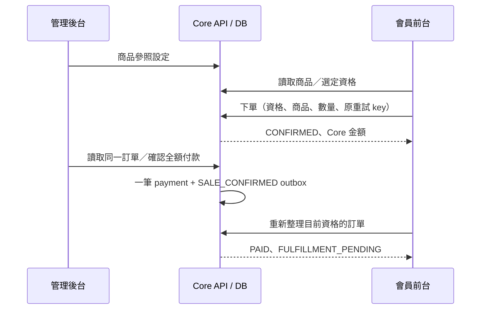

# 會員前台／管理後台整合規劃

日期：2026-09-16。制度基準：R1.0B FROZEN。本規劃以現有 API 為範圍，不新增未核准的金流、PV/BV 或資格制度。

本批次已串接並測試商品設定、會員下單、後台查單／收款、會員重新讀取付款狀態。新增會員「重新整理訂單」入口，處理後台更新後前台仍顯示先前資料的情況。正式 LIFF／Entra／裝置 UAT 與 Production Promotion 尚未完成。

## 共用識別與資料契約

| 項目 | 前台／後台對應 | 整合要求 |
|---|---|---|
| Person | Member me.memberNo ↔ Admin personId | 名稱使用 preferredName ?? legalName；聯絡資料屬 Person，不拆成每球 |
| Qualification | Member id ↔ Admin qualificationId | Person 1:N；所有私有列表與詳情帶目前資格；另一個自有球的訂單詳情仍不可讀取 |
| Active | Member temporal Active ↔ Admin current flag | 不直接比較這兩個不同語意的欄位；歷史認列以 temporal evidence 為準 |
| 商品 | Member id/name/price ↔ Admin productId/displayName/currentPrice | Member price 是顯示 DTO；設定／下單金額由 Core Decimal 決定；available 表示可下單，不代表庫存 |
| 訂單 | Member id/total ↔ Admin orderId/netAmount | 詳情保留 Core decimal string；改價不改原訂單；重試不重新定價 |
| 狀態 | Core CONFIRMED → PAID | Member 訂單列表具有 paymentStatus/shipmentStatus；詳情目前主要提供 Core status，不假設兩份 DTO 欄位完全相同 |
| Envelope | data + meta.api_version/request_id/timestamp | 兩端驗證各自 DTO；截取契約資料時必須保留原始 metadata |
| 憑證 | Member LINE session／Admin opaque session | 使用不同儲存 key；兩端 bearer 不互用；角色仍由現有 Core policy 執行 |

## 驗證次序與驗收條件

| 次序 | 工作 | 狀態／具體驗收 |
|---|---|---|
| 1 | 商品 → 下單 → 收款 → 重讀 | 本批次 PASS：59 個實際 HTTP/DB 斷言；新價只影響新單；重送只留下同一訂單／付款／outbox |
| 2 | 前端契約與狀態更新 | 本批次 PASS：真實 API 回應重播到 Member adapter／訂單 UI、Admin API／payment transport；重新整理只查目前資格 |
| 3 | 會員審批 → 前台資格列表 | 下一批：實際 Admin application approval 後 Member 新球可見；錯誤 placement、audit rollback、重送不新增第二球；保持 Sponsor/Binary 分離 |
| 4 | 退貨／replay → 兩端唯讀結果 | 下一批：以既有明確 original allocation facts 驗證 reversal/recovery；原 PAID/award/ledger 不改寫；前台若無 return DTO，先明列缺口再實作，不從 paidAt 推測退款 |
| 5 | 訂閱／認列 → Member repurchase | 待工程與設定：versioned timezone/scheduling、取消重送/rollback、歷史 RPV；不得自行決定 production cut-off 或比例分攤 |
| 6 | 正式雙瀏覽器 Golden Journey | 待 LIFF/Entra credentials：會員瀏覽器建立訂單、管理員瀏覽器確認收款、會員點重新整理，並執行跨球與 session-expiry 測試及簽核 |

## 已知工程缺口與界線

- 兩端目前沒有即時共享快取失效或 push：會員使用明確的重新整理操作讀取 Core 最新紀錄。未宣稱自動同步。
- Admin 商品設定是 SKU upsert，尚未在本批次建立與付款／會員 mutation 相同的完整 idempotency/audit 證據；版本改率仍 fail closed。若後續增加商品寫入流程，先補這項工程證據。
- 收款測試只證明 Core 手動確認／transactional outbox。未執行外部 payment gateway、SALE_CONFIRMED-to-PV 正式 mapping、ERP 出貨或 LINE push。
- 會員簽入使用隔離測試的 synthetic LINE verifier；Admin 使用實際 opaque session 與角色 guard。這不是正式供應商憑證驗證。
- Backend 尚有 52 個 executable TODO；本批次新增的整合測試不算 TODO burn-down。K1/K2 全期 replay、carry convergence/maxWeeks/resume、formal Security/UAT 仍阻擋 Production。

驗證結果與重跑方式見 [REPORT.md](REPORT.md)。
