# UCell R1.0B 本機測試系統使用說明

產製日期：2026-09-18  
來源分支：`integration/member-backend-mvp`  
更新日期：2026-09-18
來源 HEAD：`9c8426eb66cbf8bd75872d5bb8f0b4129f4a2493`

本版已同步 UCell Premium Biotech × FinTech 視覺、Admin Operations Command Center、Member 身分控制台、組織節點視圖、Award lifecycle，以及受治理 UAT evidence 唯讀面板。

簡報版：[`UCell-R1.0B-本機測試系統使用手冊-UX更新版.pptx`](UCell-R1.0B-本機測試系統使用手冊-UX更新版.pptx)

## 環境界線

- Member：`http://127.0.0.1:5174/`，使用 `VITE_ENABLE_MOCK=true`。畫面資料只供 UI 操作示範，不代表真實業績、獎金或訂單。
- Admin：`http://127.0.0.1:4173/login`，使用 DEV Super Admin 與隔離資料庫 `ucell_admin_test`。
- Admin API：`http://127.0.0.1:3001/api/v1`；健康檢查為 `/health`。
- PostgreSQL：Docker PostgreSQL 16，port `5432`。
- 正式 LINE LIFF、Microsoft Entra/RBAC、UAT 與 Production Gate 均未由此本機環境驗證；Production Promotion 仍為 BLOCKED。

## 啟動方式

在 PowerShell 分別執行：

```powershell
cd C:\UCell\UCell
docker compose -f backend/docker-compose.yml up -d

powershell -ExecutionPolicy Bypass -File .\scripts\start-admin-full-test.ps1
powershell -ExecutionPolicy Bypass -File .\scripts\start-admin-full-ui.ps1

cd .\member
$env:VITE_ENABLE_MOCK='true'
pnpm dev --host 127.0.0.1 --strictPort
```

Admin 登入頁按「DEV：Super Admin」。此登入只能用於本機 non-production。Admin 寫入會進入 `ucell_admin_test`，不要把畫面或資料當成 Stage/UAT 證據。

### 啟動後檢查

```powershell
Invoke-WebRequest http://127.0.0.1:3001/api/v1/health -UseBasicParsing
Invoke-WebRequest http://127.0.0.1:4173/ -UseBasicParsing
Invoke-WebRequest http://127.0.0.1:5174/ -UseBasicParsing
```

三個網址應回應 HTTP 200。若 Admin 顯示登入頁，請按「DEV：Super Admin」。Member 頂端若顯示「DEV 示範模式」，代表目前使用明確的視覺 fixture。

## Member 前台

### 1. 首頁／會員中心 — `/`

先確認目前 Qualification/Ball。新版首頁使用會員控制台呈現會員、資格與球位，再依序顯示 Active、重購、PV/RPV/EPV、獎金狀態與快速服務。`PENDING + amount:null` 顯示「結算中」，不顯示 NT$0。

操作順序：

1. 在「目前資格」選擇 Qualification/Ball。
2. 確認畫面顯示「以下組織、業績與獎金均屬此資格」。
3. 查看 Active 與本月重購狀態。
4. 查看 Backend/fixture 回傳的 PV、RPV、EPV。
5. 使用底部導覽或快速服務進入其他功能。

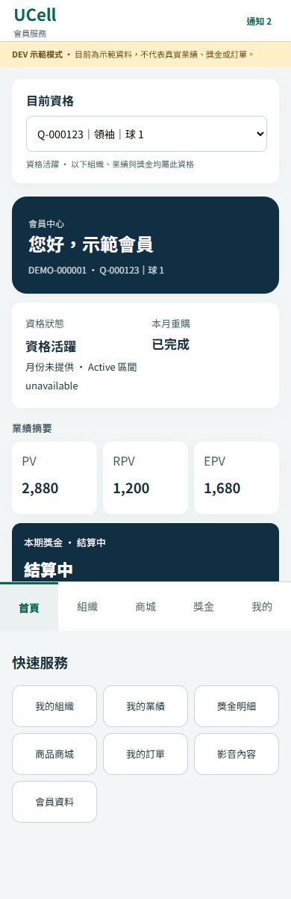

### 2. 我的組織 — `/organization`

Sponsor Tree 與 Binary Tree 使用不同頁籤與語意。推薦組織以推薦人節點與直推 network 呈現；二元安置組織使用獨立的左右區面板。切換球後，畫面上所有組織資料都應跟著目前 Qualification 更新。缺少正式 settlement read model 時，業績與 Carry 顯示 unavailable，不從其他數值推算。

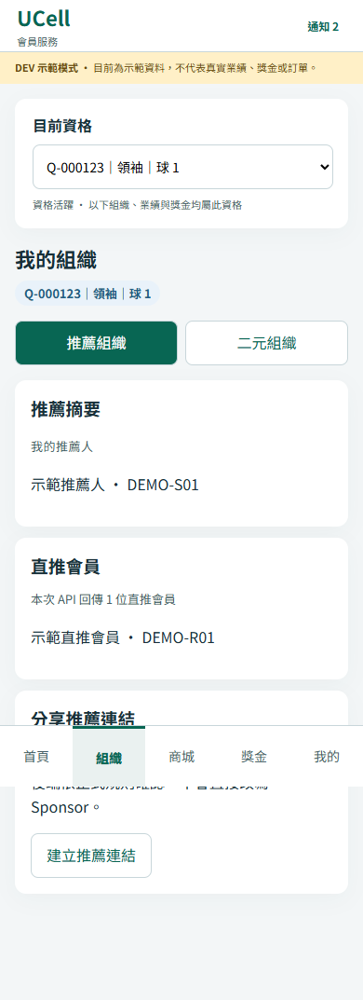

### 3. 我的業績 — `/performance`

選擇月份後查看目前 Qualification 的 PV、RPV、EPV、左右區業績與更新時間。所有數值以 Backend 為權威來源。

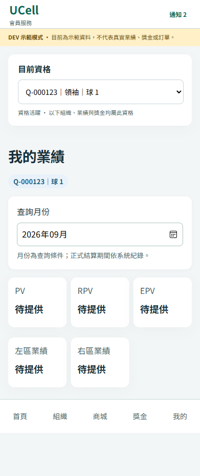

### 4. 獎金明細 — `/bonuses`

查看 Award lifecycle：CALCULATED、PENDING45D、EFFECTIVE、PAYABLE、PAID。介面只標示 Backend 回傳的目前狀態，不推測其他階段已完成。展開制度明細可查看 Settlement、Rule Version 與 Parameter Snapshot evidence；Adjustment、Reversal、Clawback 保留 append-only 紀錄。

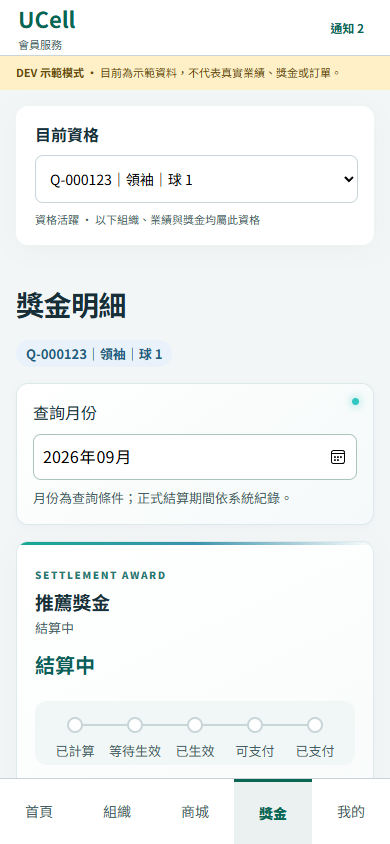

### 5. 商品商城 — `/shop`

本頁示範加入購物車與建立示範訂單。正式價格與 PV 必須由 Backend 回傳；DEV Mock 不扣款、不出貨、不產生正式 PV。

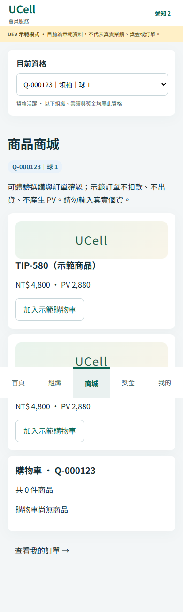

### 6. 我的訂單 — `/orders`

訂單依目前 Qualification 隔離。展開可查看付款與配送狀態；重複送出正式建立訂單時必須沿用 idempotency key。

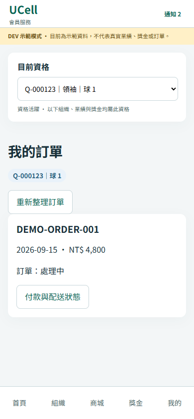

### 7. 影音與內容 — `/content`

只顯示後台已核准發布、符合顯示期間與資格條件的外部 HTTPS 內容。此 DEV Mock 沒有內容 fixture 時會顯示統一的 unavailable/error state。


### 8. 內容詳情 — `/content/:id`

詳情包含摘要、發布時間與外部連結；可分享內容才顯示推薦分享。下圖使用不存在的 DEV fixture，示範 fail-closed 狀態，不會捏造內容。

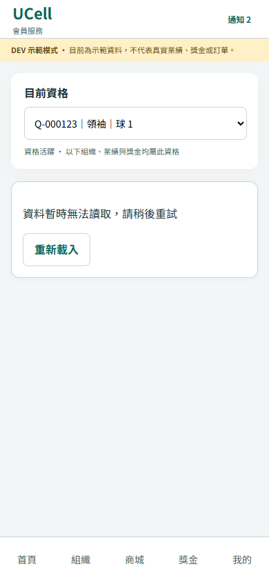

### 9. 通知中心 — `/notifications`

可依分類與未讀狀態篩選，支援單筆或全部標示已讀。DEV Mock 的 read state 僅存在本機頁面狀態。

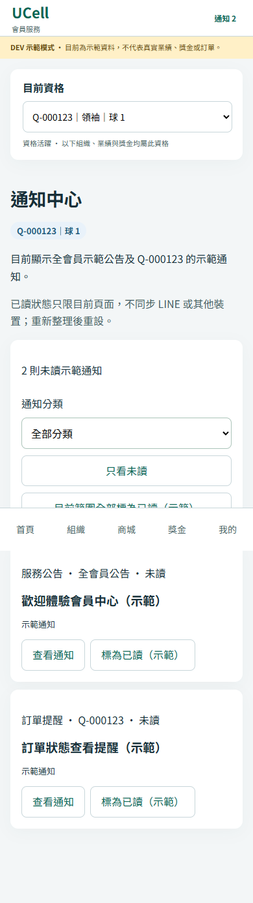

### 10. 我的帳戶 — `/me`

Person-level 資料與 1:N Qualifications/Balls 分開顯示。正式 Connected 模式才允許透過 Backend 更新可編輯個人欄位。

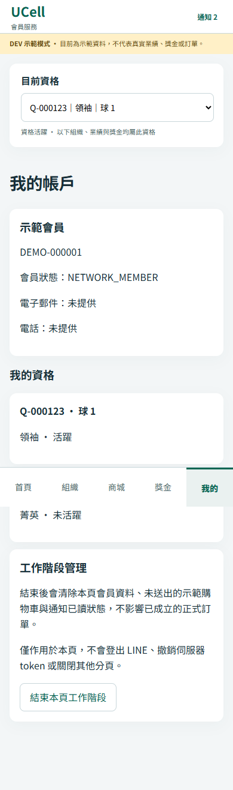

## Admin 後台

### 0. 登入 — `/login`

正式環境使用 Microsoft Entra。此本機環境按「DEV：Super Admin」進入隔離測試資料庫。

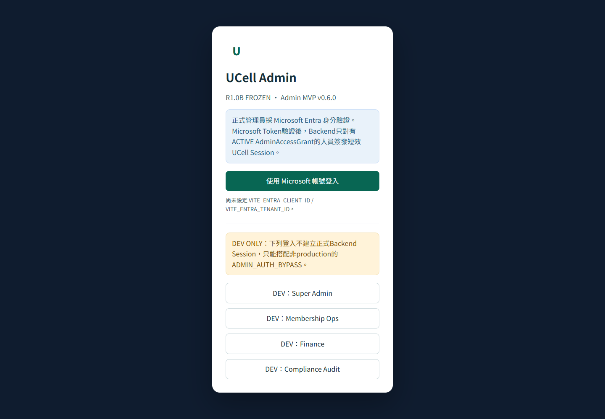

### 1. 營運總覽 — `/`

新版 Operations Command Center 顯示 Backend authoritative Read Model、Rule Version、Snapshot time、Person/Qualification/Active/Application KPI，以及目前 record-status composition。組成圖只視覺化 Backend 回傳的非金額 count，並提供文字與 source。尚未接入的 NASL、GMV、Organization Health、Settlement/Security Read Models 顯示 unavailable，不填假資料。

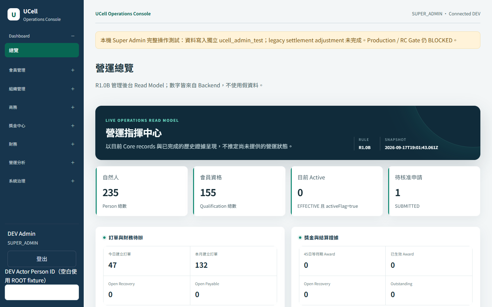

### 2. 會員／自然人 — `/people`

搜尋 Person，從 Drawer 查看 identity、狀態與 1:N Qualifications，再進入 Qualification detail。Person 與 Qualification 不可混用。

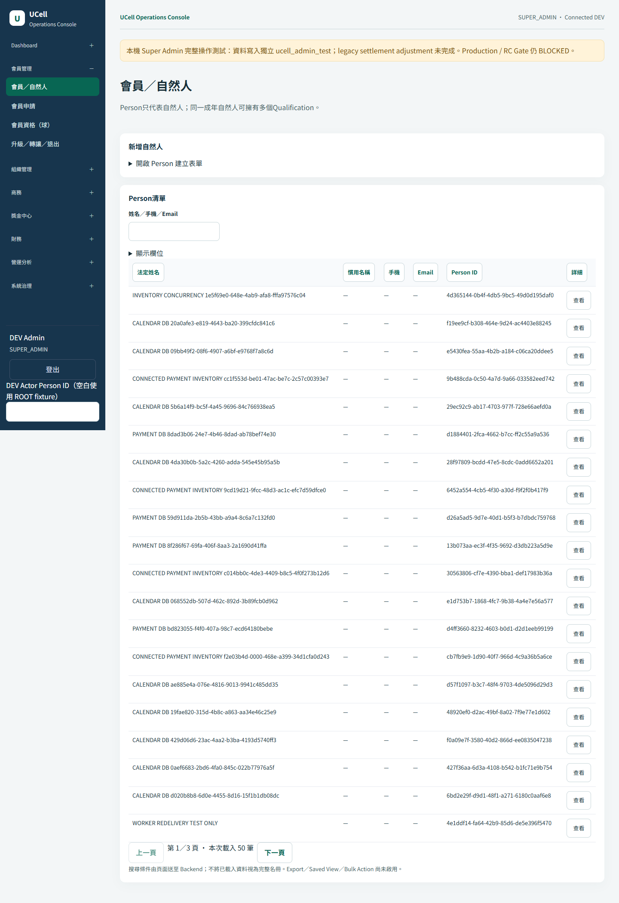

### 3. 會員申請待審 — `/applications`

管理 Draft → Submitted → Effective。Approve 才建立 Qualification、Sponsor 與 Binary placement facts。正式會員補件草稿只顯示遮罩後 metadata 與 evidence hash。

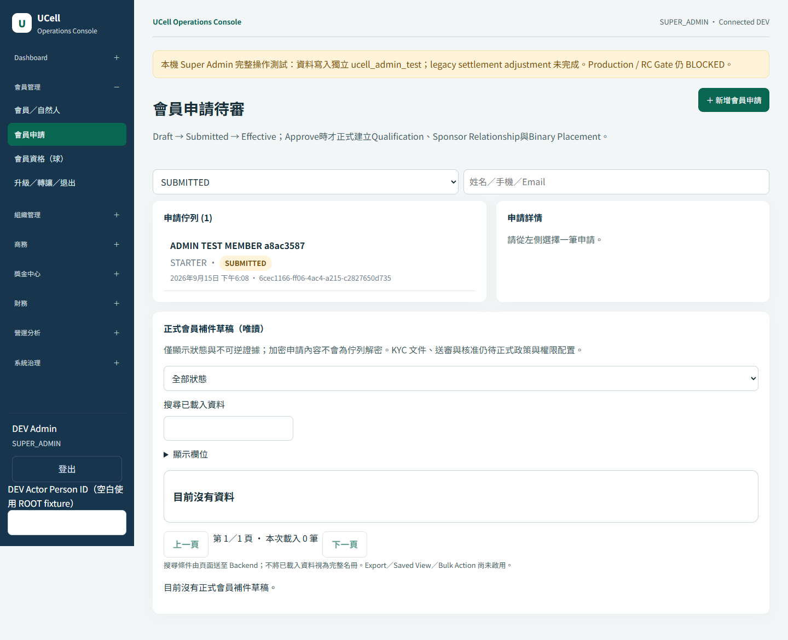

### 4. 新增會員申請 — `/applications/new`

依序選 Person、方案與 Sponsor、Binary parent/side，預檢後建立 Draft。送出與核准是不同操作。

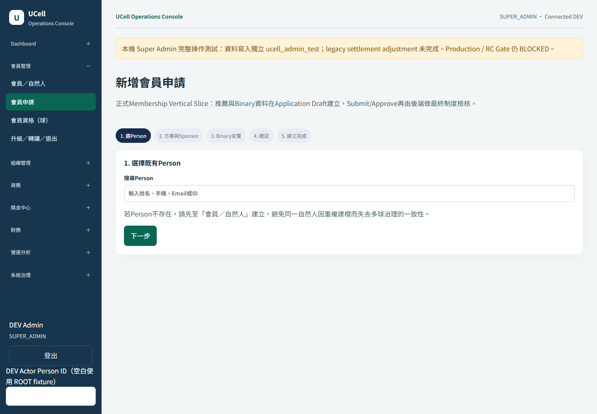

### 5. 會員資格（球）— `/qualifications`

Qualification master-detail 含 Overview、Sponsor、Binary、Active、PV/RPV/EPV、Orders、Bonus、Ledger、Settlement、Audit。所有 evidence 必須屬於同一 Qualification。


### 6. 商品參照 — `/products`

管理 UCell Core 使用的商品參照與 versioned rule profile。Inventory、Accounting 與實體 Fulfillment 仍屬 ERP 邊界。

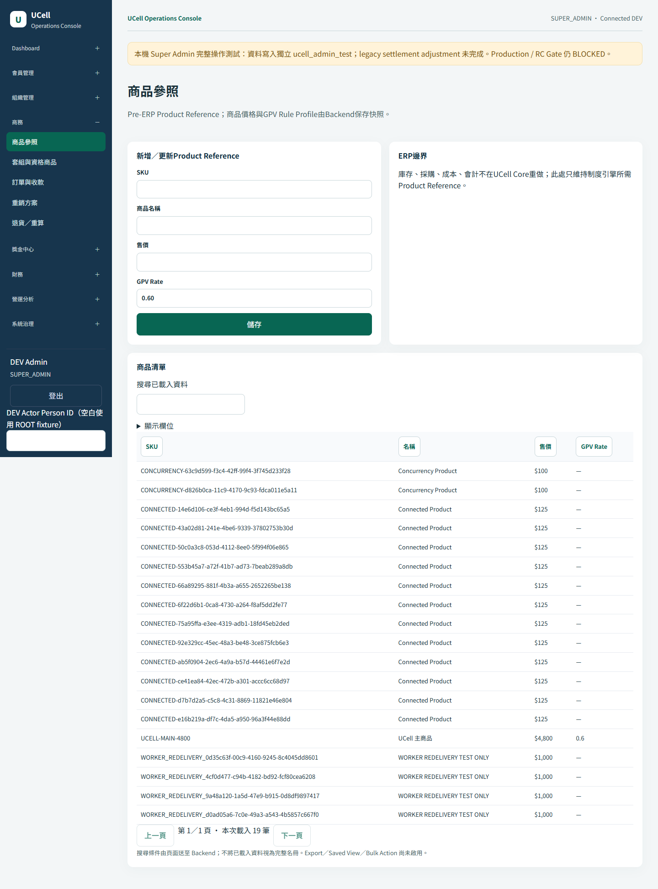

### 7. 套組與資格商品 — `/packages`

建立套組主檔、不可變版本與商品池；建立者與核准者角色分離。Production operational calendar 未核准時應 fail closed。

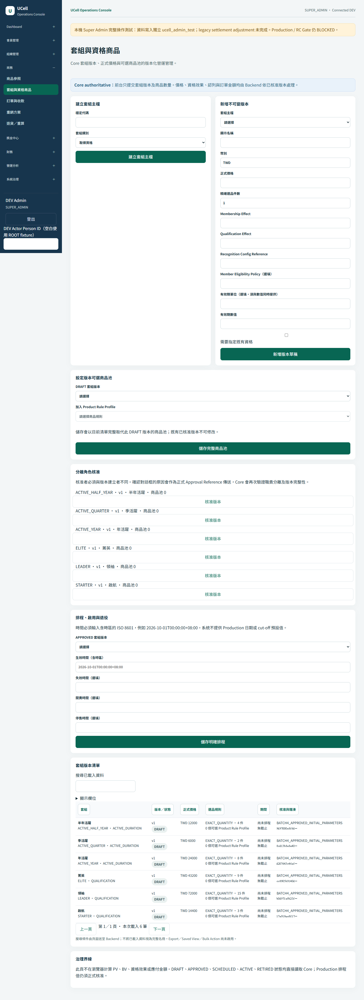

### 8. 訂單與收款 — `/orders`

依 Qualification 建立訂單並查看 detail。付款確認後才由 outbox 驅動 recognition；前端不計算價格、PV 或 BV。

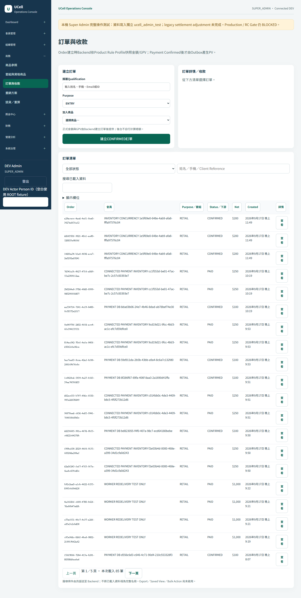

### 9. 組織視圖 — `/organization`

選 root Qualification、Sponsor/Binary 樹別、深度與 historical time point。Sponsor Tree 與 Binary Tree 永遠分離。

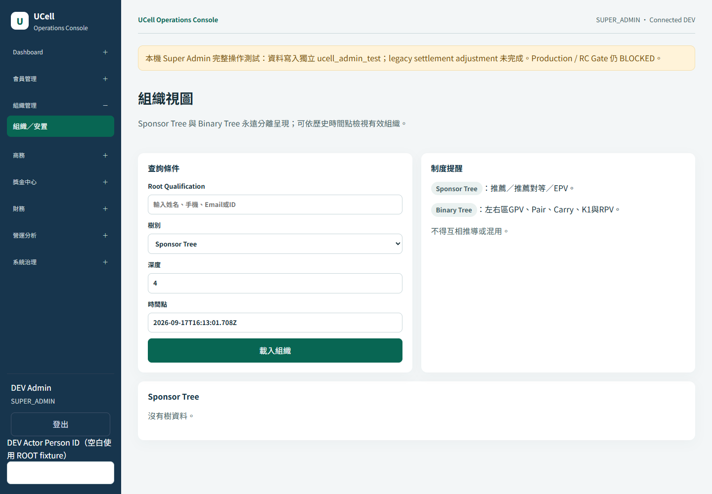

### 10. 重購訂閱 — `/subscriptions`

查看訂閱與逐期認列證據。正式 calendar/cut-off 尚未核准時，Production write path 必須回報 configuration pending。

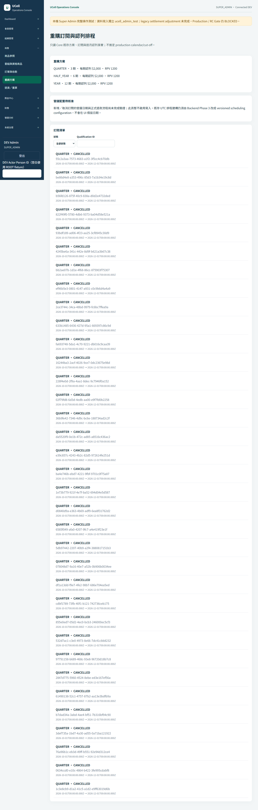

### 11. 獎金／結算營運 — `/bonuses`

查看 Data Frozen、Active、K0、K1、K2、Pools、45D、Payable pipeline，以及 Rule/Parameter/Snapshot/Replay evidence。此頁只讀 Core monetary facts。

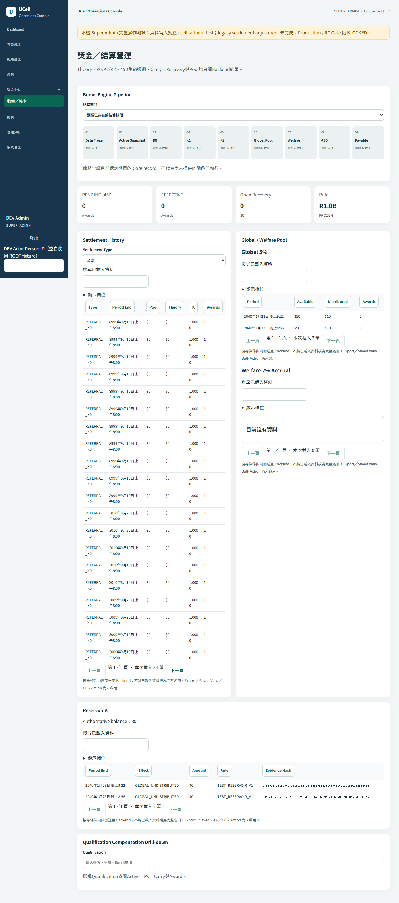

### 12. 退貨／反向／Replay — `/returns`

Return lifecycle 為 REQUESTED → APPROVED → RECEIVED → POSTED → REFUNDED；只有 POSTED 觸發 volume/bonus reversal。原 Ledger/Award/PAID 不覆寫。

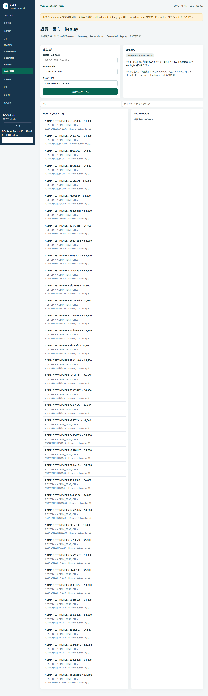

### 13. 升級／轉讓／退出 — `/workflows`

建立與審核 UPGRADE、TRANSFER、EXIT、COMPANY_RETRANSFER。核准只對未來生效，不回寫歷史 monetary facts。

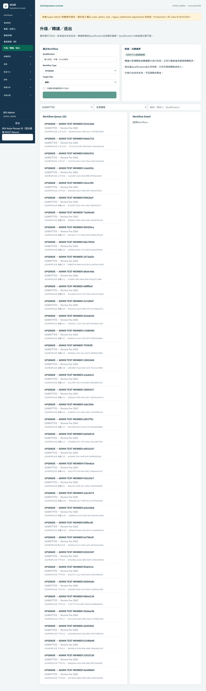

### 14. 結算／付款 — `/payouts`

將有效 Award materialize 為 payout batch，經 Finance 與 Compliance 不同 actor 雙核准，再記錄外部付款 reconciliation。系統本身不直接匯款。

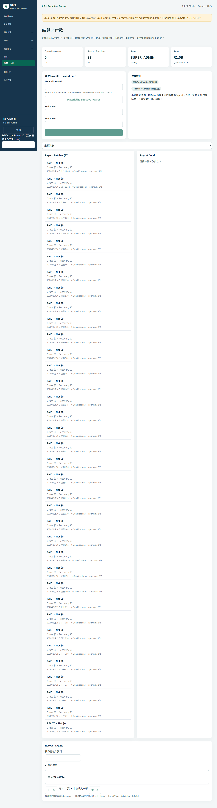

### 15. 影音／連結內容 — `/content`

建立內容與不可變版本，使用 approval reference 發布。已發布版本不覆寫；以新版本取代。

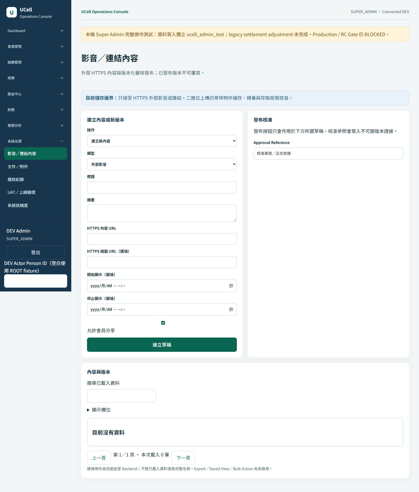

### 16. 文件／附件 — `/documents`

依 Entity 登錄 immutable metadata、SHA-256、storage provider 與 object key。新版本 supersede 舊版，不刪除歷史。

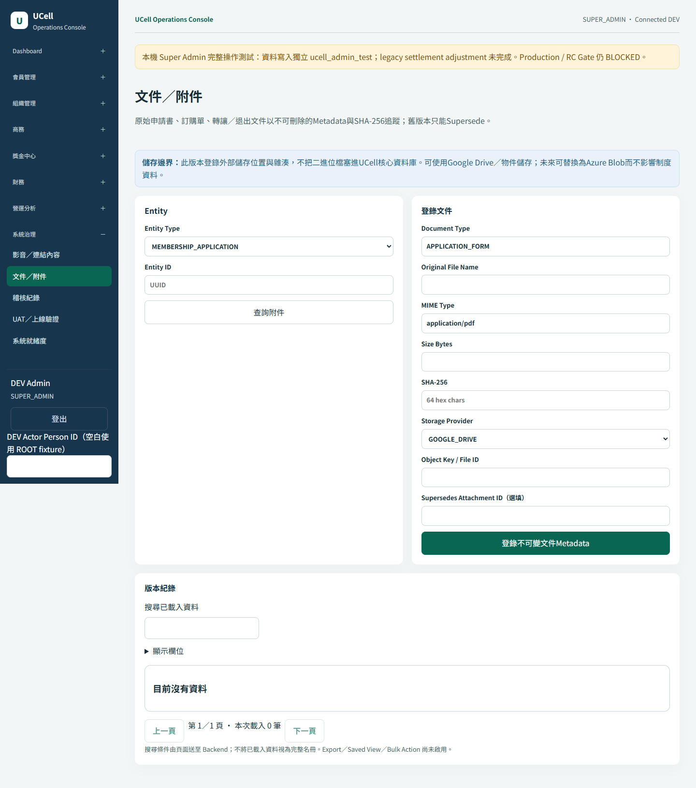

### 17. 稽核紀錄 — `/audit`

依 entity、action、correlation 與時間搜尋；detail 顯示 actor、request/correlation、reason、before/after。

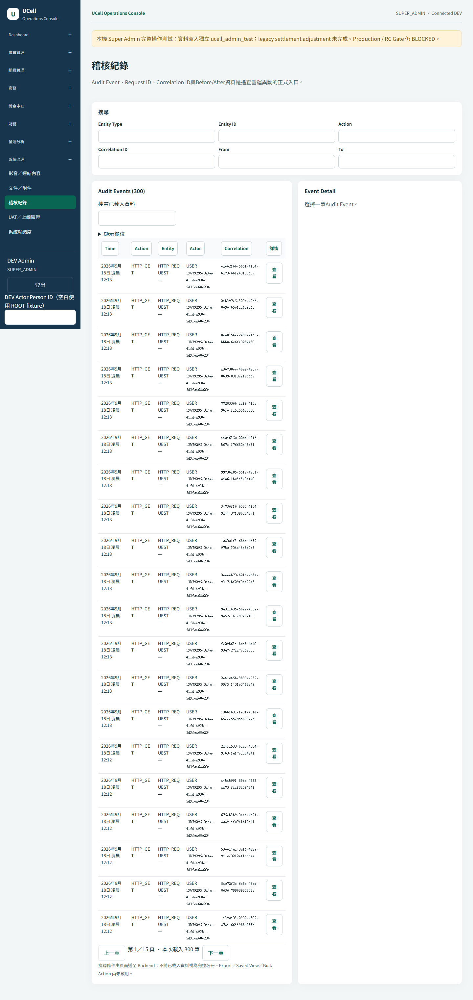

### 18. 報表／完整性 — `/reports`

按期間查詢並匯出 authorized CSV。Integrity Alerts 只偵測異常，不自動修改資料。

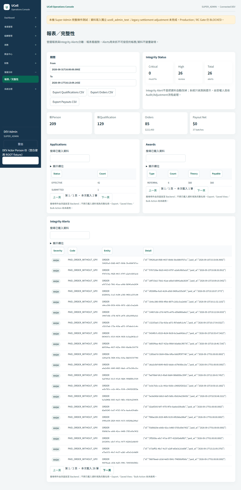

### 19. UAT Console — `/uat`

上半部以 localStorage 記錄 NOT_RUN、PASS、FAIL、BLOCKED、Tester 與本機 Evidence。下半部唯讀顯示 `GET /admin/uat-evidence` 回傳的 append-only evidence metadata，可依 environment 與 scenario 篩選。兩區資料完全分離；所有 API evidence 仍顯示 `formalSignOff: false`，不得用來宣告 Release Gate PASS 或 Production Promotion。

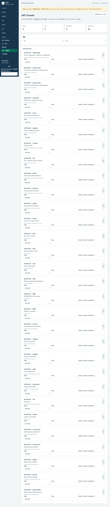

### 20. 系統就緒度 — `/system`

查看 Backend contract、Admin MVP、release obligations 與 blocker。正式憑證、UAT、Backup/Restore、Security E2E 等未完成前保持 Production BLOCKED。

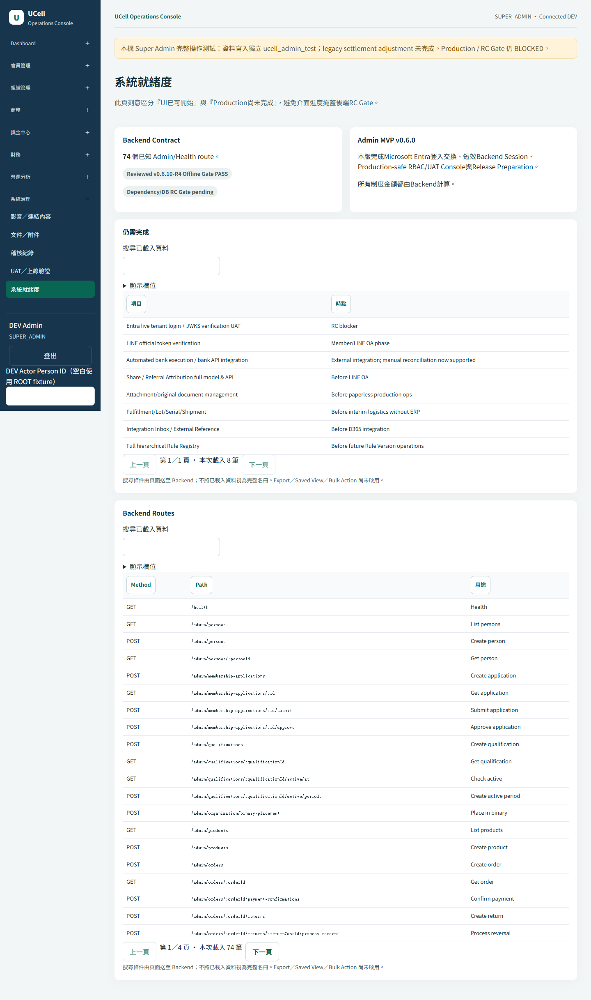

## 測試注意事項

1. Member 切換 Qualification 後，組織、業績、獎金與 Ledger 必須同步顯示目前球位，不能 cross-ball leakage。
2. 所有金額、PV/RPV/EPV、Carry、Matching、Pool、Clawback 均由 Backend authoritative result 顯示，前端不得推導。
3. Admin 高風險操作需確認、理由與 audit evidence；請只在 `ucell_admin_test` 操作。
4. 本機完整權限模式是功能測試工具，不代表正式 Entra RBAC 或 Production 授權已通過。
5. 截圖清單與 fixture 說明可查閱同目錄 `capture-results.json`。
6. Premium UI 自動驗證涵蓋 Member 375／390／430／768，以及 Admin 768／1366／1440／1920；完整 manual screen-reader/WCAG audit 尚未完成。
